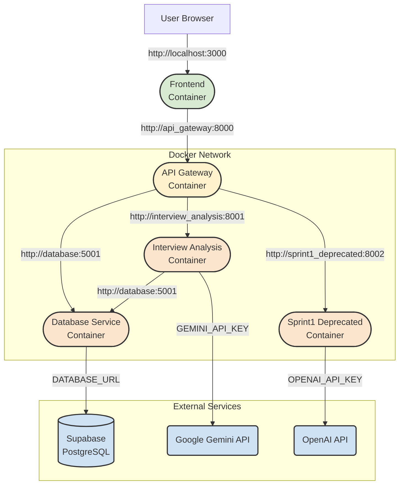

# Navi CFCI Architecture

This document outlines the technical architecture of the Navi CFCI platform.

## 1. System Overview

Navi CFCI is a microservices-based application designed to analyze user interview transcripts (VTT format) using AI and provide insights through a web interface. It features user authentication and a clear separation between frontend presentation, API routing, and backend processing.

The system employs a hybrid deployment model:
*   **Frontend:** Next.js application hosted on Vercel.
*   **Backend:** Python/FastAPI microservices hosted as containers on Google Cloud Run.
*   **Database:** PostgreSQL hosted on Supabase.

## 2. High-Level Architecture Diagram (Production)

```mermaid
graph LR
    User[User Browser] --> FE([Frontend<br>(Next.js on Vercel)]);
    FE -->|HTTPS API Call<br>(JWS Auth)| APIGW([API Gateway<br>(FastAPI on Cloud Run - Public)]);
    
    subgraph Google Cloud Run (us-central1)
      direction LR
      APIGW -->|IAM Auth Request<br>(Service Account)| IA([Interview Analysis<br>(FastAPI - Private)]);
      APIGW -->|IAM Auth Request<br>(Service Account)| DBService([Database Service<br>(Node/Express - Private)]);
      APIGW -->|IAM Auth Request<br>(Service Account)| S1([Sprint1 Deprecated<br>(FastAPI - Private)]);
      IA -->|IAM Auth Request<br>(Service Account)| DBService;
    end

    subgraph External Services
      direction TB
      DBService -->|SQL Connection| Postgres[(Supabase<br>PostgreSQL)];
      IA --> |HTTPS API Call<br>(API Key)| Gemini(Google Gemini API);
      S1 --> |HTTPS API Call<br>(API Key)| OpenAI(OpenAI API);
    end

    style FE fill:#D9EAD3,stroke:#333,stroke-width:2px
    style APIGW fill:#FFF2CC,stroke:#333,stroke-width:2px
    style IA fill:#FCE5CD,stroke:#333,stroke-width:2px
    style DBService fill:#FCE5CD,stroke:#333,stroke-width:2px
    style S1 fill:#FCE5CD,stroke:#333,stroke-width:2px
    style PG fill:#CFE2F3,stroke:#333,stroke-width:2px
    style Gemini fill:#CFE2F3,stroke:#333,stroke-width:2px
    style OpenAI fill:#CFE2F3,stroke:#333,stroke-width:2px

```

## 3. Component Descriptions

*   **Frontend (`frontend/`)**
    *   **Framework:** Next.js 15+ (React 18)
    *   **Language:** TypeScript
    *   **Styling:** Tailwind CSS, shadcn/ui components
    *   **Responsibilities:** User interface, dashboard display, transcript upload, visualization of analysis, user login/registration (via NextAuth).
    *   **Communication:** Interacts *only* with the API Gateway via HTTPS API calls, sending user authentication (JWS token) in the `Authorization` header.
*   **API Gateway (`services/api_gateway/`)**
    *   **Framework:** FastAPI (Python 3.11+)
    *   **Responsibilities:** Single public entry point for the frontend. Validates incoming user JWS tokens. Routes requests to appropriate backend microservices. Handles CORS. Aggregates responses if needed.
    *   **Authentication:**
        *   Validates user JWS tokens from the frontend using a shared secret.
        *   Uses Google IAM (OIDC tokens via service account) to authenticate its requests *to* backend services in production.
    *   **Deployment:** Google Cloud Run (configured for public access).
*   **Interview Analysis Service (`services/interview_analysis/`)**
    *   **Framework:** FastAPI (Python 3.11+)
    *   **Responsibilities:** Core analysis logic. Processes VTT files, interacts with Google Gemini API via a defined pipeline to extract problem areas, synthesis, etc. Stores results via the Database Service.
    *   **Authentication:** Accessed *only* by the API Gateway via IAM authentication.
    *   **Deployment:** Google Cloud Run (configured for private access - no-allow-unauthenticated).
*   **Database Service (`services/database/`)**
    *   **Framework:** Node.js/Express (TypeScript)
    *   **Database ORM:** Prisma
    *   **Responsibilities:** Provides a RESTful API wrapper around the PostgreSQL database. Handles CRUD operations for interviews, users, etc.
    *   **Authentication:** Accessed *only* by the API Gateway and Interview Analysis service via IAM authentication.
    *   **Deployment:** Google Cloud Run (configured for private access - no-allow-unauthenticated).
*   **Sprint1 Deprecated Service (`services/sprint1_deprecated/`)**
    *   **Framework:** FastAPI (Python 3.11+)
    *   **Responsibilities:** Legacy functionality (keyword extraction, summarization) possibly using OpenAI.
    *   **Authentication:** Accessed *only* by the API Gateway via IAM authentication.
    *   **Deployment:** Google Cloud Run (configured for private access - no-allow-unauthenticated).
*   **Database (External)**
    *   **Provider:** Supabase (PostgreSQL)
    *   **Responsibilities:** Persistent storage for users, interviews, analysis results.

## 4. Communication & Data Flow

*   **User Request:** User interacts with the Vercel frontend.
*   **Frontend -> Gateway:** Frontend (server-side API routes) authenticates user session, generates a short-lived JWS, and sends API requests to the public API Gateway URL with `Authorization: Bearer <JWS_Token>`.
*   **Gateway -> Backend:** API Gateway validates the JWS. If valid, it determines the target backend service. It then makes a request to the backend service's private Cloud Run URL, authenticating itself using its own service account's IAM OIDC token in the `Authorization` header. User-specific context (like `userId`) is passed in query parameters or request body.
*   **Backend -> Database:** Services like Interview Analysis call the Database Service similarly (using IAM auth in production) to store or retrieve data.
*   **Responses:** Follow the reverse path.

## 5. Local Development Architecture

Docker Compose simulates the production environment by creating a network where services can communicate via service names.



*   **Authentication:** User auth uses JWTs signed/verified with the local `NEXTAUTH_SECRET`/`JWT_SECRET`. Service-to-service calls within Docker are direct HTTP (no IAM involved).
*   **URLs:** Frontend uses `http://localhost:8000` for client-side calls, but its *server-side* API routes use `http://api_gateway:8000`. Backend services use Docker service names (e.g., `http://database:5001`).

## 6. Technology Stack Summary

*   **Frontend:** Next.js, React, TypeScript, Tailwind CSS, shadcn/ui, NextAuth.js
*   **Backend:** Python 3.11+, FastAPI, Pydantic
*   **Database:** PostgreSQL (Supabase), Prisma (Database Service: Node.js, Express, TypeScript)
*   **AI:** Google Gemini (Primary), OpenAI (Deprecated)
*   **Infrastructure:** Docker, Google Cloud Run, Vercel, Google Secret Manager
*   **CI/CD:** GitHub Actions (Optional) 